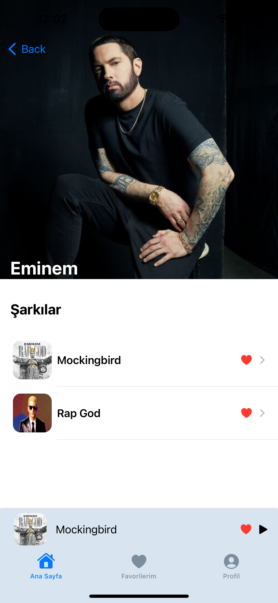

# MusicPlayer-SwiftUI

## Uygulama Özellikleri
Google Sign-In

Firebase (Firestore, Firebase Authentication, Cloud Storage)

MVVM architecture
## Uygulama Ekran Görüntüleri
| | |
|:-------------------------:|:-------------------------:|
|   |  |
|  |  |
| |  |
| |  |
